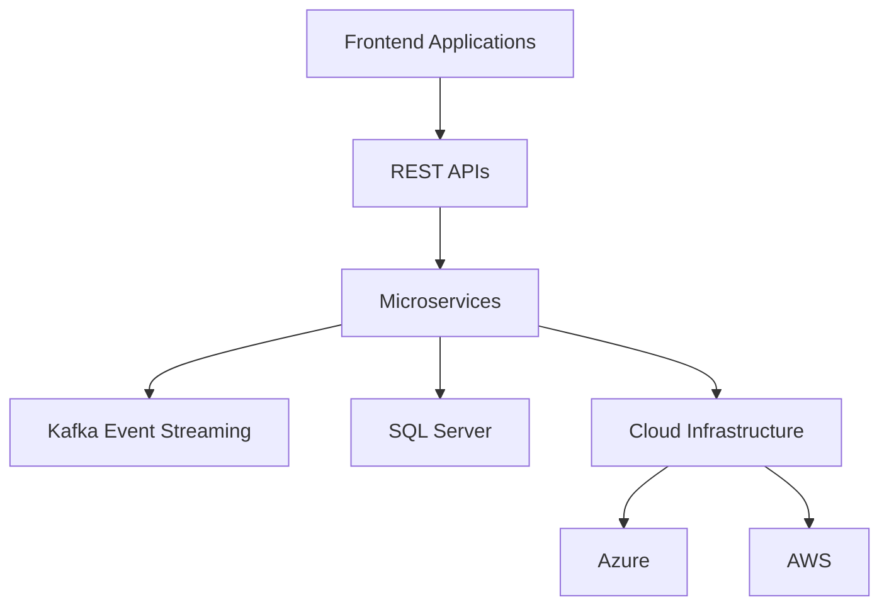

# <div align="center"> Hi!! This is Triveni Valeti</div>

<div align="center">


</div>

---

<div align="center">


</div>

---

# 👨‍💻 About Me


Senior **.NET Full Stack Developer** with **11+ years** of experience building enterprise-grade applications across healthcare, banking, airline, retail, and government domains.

Passionate about designing scalable distributed systems using:

- ⚡ **ASP.NET Core Web API & Microservices**
- ☁️ **Microsoft Azure & AWS Cloud**
- 🎨 **Angular & React Frontend Applications**
- 🔄 **Event-Driven Architectures & Kafka**
- 🤖 **AI-Powered Development Solutions**
- 🔐 **Secure Enterprise Integrations**

I specialize in building highly scalable applications with modern architecture patterns, cloud-native deployments, and intelligent workflow automation.

---

# 🛠️ Tech Stack

<div align="center">

## 💻 Backend Technologies


## 🎨 Frontend Technologies


## ☁️ Cloud & DevOps


## 🗄️ Databases


</div>

---

# 📊 Professional Experience

<div align="center">

| Experience | Domains | Projects |
|------------|----------|-----------|
| 11+ Years | Healthcare, Banking, Airline, Government | Enterprise Applications |

</div>

### 🚀 Enterprise Expertise

✅ Built scalable **Microservices Architectures** processing high-volume enterprise transactions.

✅ Developed secure **RESTful APIs** with OAuth2, JWT, API Gateway, caching, and enterprise integrations.

✅ Designed responsive enterprise applications using **Angular 18**, **React 18**, and modern UI frameworks.

✅ Implemented **Apache Kafka**, **RabbitMQ**, and event-driven systems enabling reliable asynchronous communication.

✅ Developed real-time dashboards using **Blazor Server** and **SignalR** supporting enterprise operational workflows.

✅ Optimized enterprise SQL workloads reducing transaction latency and improving large-scale application performance.

✅ Automated CI/CD pipelines using **Azure DevOps**, **Docker**, **Kubernetes**, and **Jenkins**.

✅ Integrated AI-powered development workflows using **Azure OpenAI**, **GitHub Copilot**, **Cursor AI**, and **GPT-4**.

---

# 🧠 Architecture & Engineering Skills

<div align="center">



</div>

### 🔥 Core Specializations

- Microservices Architecture
- Clean Architecture
- Onion Architecture
- Event-Driven Systems
- Distributed Systems
- Cloud-Native Development
- Enterprise API Design
- Real-Time Applications
- Authentication & Authorization
- Performance Optimization
- AI-Assisted Development
- Agile Scrum Methodologies

---

# 📈 GitHub Stats

<div align="center">


</div>

---

# 🌎 Connect With Me

<div align="center">

<a href="https://www.linkedin.com/in/trivenivc-2219bb02cc">
  
</a>

<a href="mailto:triveni.vc19@gmail.com">
  
</a>

<a href="https://github.com/YOUR_GITHUB_USERNAME">
  
</a>

</div>

<div align="center">

### 📬 Contact Information

📌 **LinkedIn:** www.linkedin.com/in/trivenivc-2219bb02cc  
📧 **Gmail:** triveni.vc19@gmail.com  
📱 **Phone:** +1 7042866536  
💻 **GitHub:** Add Your GitHub Profile URL Here  

</div>

---

# ⚡ Fun Fact

```yaml
while(alive) {
   eat();
   code();
   build_scalable_systems();
   repeat();
}
```

---

<div align="center">

### ⭐ Building Scalable Enterprise Solutions With Modern Technologies ⭐


</div>
